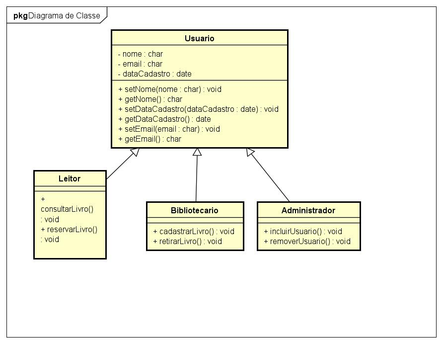

# Projeto Biblioteca Digital: Herança e Polimorfismo em Java

## 📜 Sobre o Projeto

Este projeto Java simula parte de um sistema de gerenciamento de usuários para uma biblioteca digital que gerencia diferentes tipos de usuários e seus privilégios de acesso. O sistema precisa lidar com leitores, bibliotecários e administradores, cada qual com características e responsabilidades distintas. O objetivo principal é aplicar os conceitos de **Herança** e **Polimorfismo** para modelar esses perfis.

O sistema baseia-se em uma hierarquia de classes, onde a superclasse define as características comuns, e as subclasses especializam o comportamento e adicionam permissões específicas.

##  UML - Diagrama de Classes

A imagem abaixo ilustra a estrutura das classes e a relação de herança entre elas, conforme a modelagem do sistema:

 
## 🛠️ Estrutura do Projeto

O projeto é composto por cinco classes principais:

1.  **`Usuario.java`**: A superclasse que define atributos comuns a todos os usuários (nome, email e data de cadastro).
2.  **`Leitor.java`**: Subclasse que herda de `Usuario`.
3.  **`Bibliotecario.java`**: Subclasse que herda de `Usuario`.
4.  **`Administrador.java`**: Subclasse que herda de `Usuario`.
5.  **`BibliotecaApp.java`**: Classe principal para a execução e demonstração dos conceitos.

## 🔑 Conceitos Aplicados

### 1. Herança (Reaproveitamento e Especialização)

A herança foi utilizada para criar uma hierarquia de classes (Leitor, Bibliotecario, Administrador herdam de Usuario), garantindo que atributos e comportamentos comuns fossem definidos apenas uma vez, evitando repetição de código.

* **Superclasse `Usuario`**: Define os atributos básicos e o método comum `exibirDados()`.
* **Subclasses**: Herdam automaticamente esses membros. A **especialização** ocorre ao adicionar métodos específicos para cada perfil:
    * **Leitor**: Pode apenas consultar e reservar livros. Métodos: `consultarLivro()`, `reservarLivro()`.
    * **Bibliotecário**: Possui as permissões de leitores e, adicionalmente, pode cadastrar e retirar livros do sistema. Métodos: `cadastrarLivro()`, `retirarLivro()`.
    * **Administrador**: Possui todas as permissões anteriores e, além disso, pode gerenciar outros usuários (incluir/remover qualquer tipo de usuário do sistema). Método: `gerenciarUsuario()`.

### 2. Polimorfismo (Comportamentos Diferentes)

O polimorfismo foi demonstrado através da sobrescrita de um método e da manipulação de uma lista de referências da superclasse.

* **Sobrescrita (`@Override`)**: O método **`exibirAcoesDisponiveis()`** foi sobrescrito em cada subclasse. Ele retorna uma *string* diferente que reflete as ações específicas daquele perfil.
* **Demonstração Prática**: Na classe `BibliotecaApp.java`, foi criada uma lista de referências do tipo **`ArrayList<Usuario>`**.
    * Ao iterar sobre esta lista (`for (Usuario usuario : listaDeUsuarios)`) e chamar o método sobrescrito (`usuario.exibirAcoesDisponiveis()`), o Java decide em **tempo de execução** qual versão do método executar.
    * Isso permite que a mesma variável de referência (`usuario` do tipo `Usuario`) gere um resultado diferente (as ações específicas) para cada objeto real (Leitor, Bibliotecário ou Administrador).

Este é um teste prático para visualizar a herança e o polimorfismo em ação.
